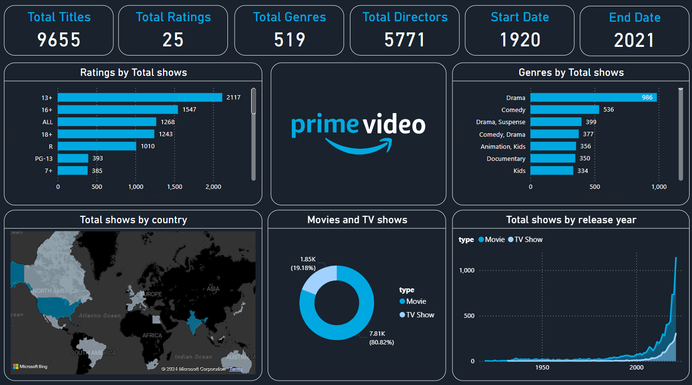

# Prime Video Analysis Dashboard

## 📝 Overview
The Prime Video Analysis Dashboard provides an insightful overview of the content available on Prime Video. It tracks various aspects of the platform, including the total number of titles, genres, ratings, and release years, offering a detailed analysis of the streaming service. This dashboard helps in understanding Prime Video's content library trends, regional distributions, and genre preferences.

## 📊 Data Source
The data for this dashboard is sourced from a comprehensive dataset of Prime Video content, which includes details about titles, genres, ratings, release years, and countries of origin.

## 🎯 Project Goals
1. Analyze the content library of Prime Video by various parameters including genre, rating, and release year.
2. Track trends in content production over the years.
3. Visualize the geographical distribution of shows on Prime Video.

## 🔍 Key Data Insights
- Genres by Total Shows: Drama is the most dominant genre with 986 shows, followed by Comedy with 536 shows.
- Ratings by Total Shows: The '13+' rating is the most common, covering over 2,117 shows.
- Total Shows by Release Year: There has been a significant increase in content production in recent years, peaking in the latest years.
- Movies vs. TV Shows: The platform hosts a majority of TV shows (80.82%) compared to movies (19.18%).

## 🖼️ Dashboard Snapshot

## 🧭 How to Use This Dashboard
- Navigate through the interactive visuals to explore different metrics.
- Use filters to focus on specific data points, such as genres or ratings.
- Hover over data points to view detailed tooltips and gain additional insights.

### This dashboard was created using Power BI's advanced visualization and data modeling features, making complex data easy to understand and act upon.
